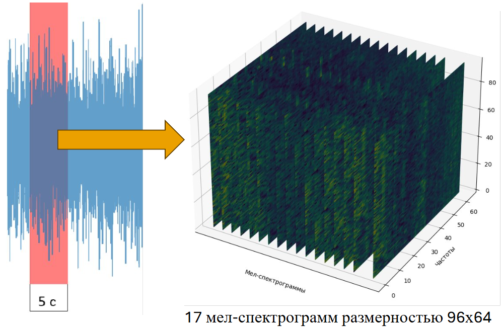
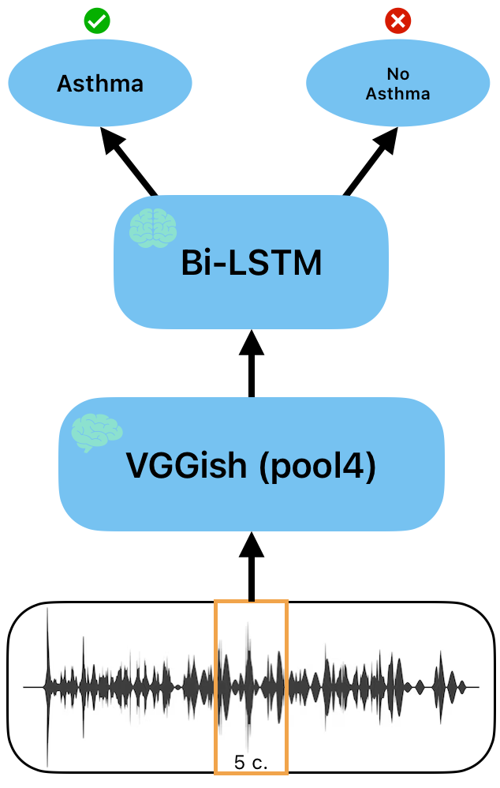

# Non-Contact-Asthma-Detection

Данный проект направлен на бесконтактное обнаружение приступов **астмы**<sup>1</sup> во сне с помощью приложения на смартфон и технологий *искуственного интеллекта*.

1) **Астма** — это хроническое заболевание легких, которое может поражать людей любого возраста. Астма вызывается воспалительным процессом и сжиманием мышц вокруг дыхательных путей, что приводит к затруднению дыхания.

## Состав команды:
Студенты 3 курса института интеллектуальной робототехники НГУ:
- Золотых Игорь
- Зырянова Мария
- Пыжьянов Егор

# Принцип работы

**Запись нарезается следующим образом:**


Для одной спектрограммы: 

- 96 — количество частично перекрывающихся кадров длительностью 25 мс в каждой мел-спектрограмме.​

- 64 — количество полос MEL в диапазоне от 125 Гц до 7,5 кГц.

Далее каждое окно обрабатывается сверточной сетью для классификации звуков VGGish, и из нее выход со слоя "pool4" передается на Bi-LSTM модель для бинарной классификации. 



- Для извлечения признаков - выход "pool4" предобученной сети VGGish.​

- Для классификации - Bi-LSTM модель.

# Результат

На основе выхода Bi-LSTM модели можно сделать вывод, были ли у человека приступы или нет, что позволит диагностировать заболевание на ранней стадди. Так же в случае тяжелого приступа подается сигнал, чтобы разбудить человека, для предотвращения смерти.

# Использование

**Установка зависимостей:**
```
pip install -r requirements.txt
```